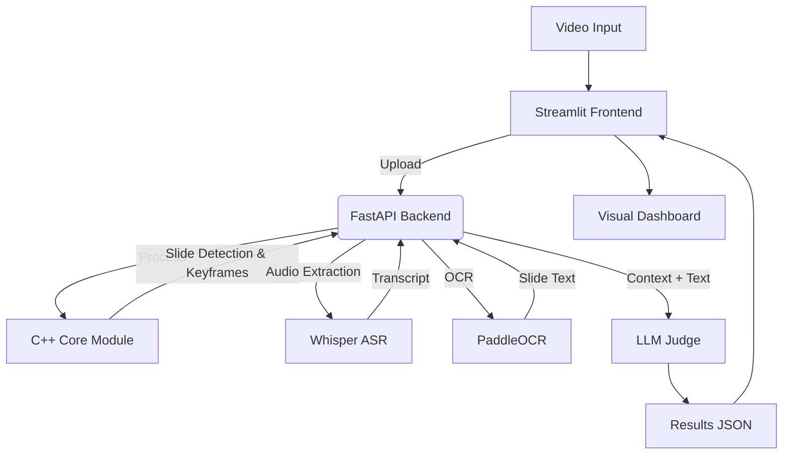

# AI-Powered Interview Judge 🧠⚖️

An end-to-end multimodal AI system designed to automatically evaluate technical interviews and presentations. The system analyzes video feeds to detect slide transitions, transcribes speech, synchronizes visual context with spoken audio, and uses LLMs to grade the candidate's performance.

## 🚀 Key Features

- **High-Performance Video Processing (C++):** A custom C++ engine using OpenCV and robust edge detection (Canny/Morphology) to identify slide transitions and keyframes, filtering out webcam noise
- **Multimodal Analysis:** Synchronizes visual data (slides) with audio transcripts (Whisper) to understand _what_ is shown vs. _what_ is said
- **AI Judging:** Uses Large Language Models (LLMs) to evaluate the relevance and accuracy of the speaker's answers based on the visual context
- **Web Interface:** Beautiful Streamlit frontend for easy video upload and result visualization
- **Hybrid Architecture:** Implements computationally heavy tasks in C++ bound to a Python backend via `pybind11`
- **RESTful API:** FastAPI-based backend for easy integration
- **Docker Ready:** Full containerization with CPU and GPU support
- **Modular Design:** Clean separation of concerns with service layer architecture

## 🛠️ Tech Stack

- **Core Engine:** C++17, OpenCV 4.x
- **Bindings:** pybind11
- **Backend:** Python 3.10+, FastAPI
- **Frontend:** Streamlit (Web UI)
- **AI/ML:** OpenAI Whisper (ASR), PaddleOCR, PyTorch, LLMs (OpenAI)
- **Build System:** CMake, uv, Docker

## 🏗️ Architecture

The project follows a **Hybrid Monorepo** structure:



## 📂 Project Structure

```
ai-interview-judge/
├── cpp_core/           # C++ Library for video processing
│   ├── include/        # Headers
│   └── src/            # Implementation & Bindings
├── backend/            # FastAPI service & Business Logic
│   ├── main.py         # API endpoints
│   ├── core/           # Configuration & logging
│   └── services/       # AI services (Whisper, OCR, LLM)
├── frontend/           # Streamlit Web UI
│   ├── app.py          # Main application
│   └── Dockerfile      # Frontend container
├── docs/               # Documentation
│   ├── QUICKSTART.md   # Quick start guide
│   ├── SHARING_GUIDE.md # Public sharing guide
│   └── ...             # Other docs
├── scripts/            # Utility scripts
│   ├── share.sh        # Public sharing (ngrok)
│   ├── start.sh        # Quick start
│   └── ...             # Other scripts
├── tests/              # GTest (C++) and Pytest (Python)
├── docker/             # Backend Dockerfiles (CPU/GPU)
└── docker-compose.yml  # Full stack orchestration
```

## 📅 Roadmap

- [x] **Sprint 1:** C++ Scene Detection Engine & Python Bindings
- [x] **Sprint 2:** Multimodal Extraction (OCR + ASR Integration)
- [x] **Sprint 3:** Logic Core & LLM Evaluation Pipeline
- [x] **Sprint 4:** MLOps (Docker, CI/CD, API)
- [x] **Sprint 5:** Streamlit Frontend & Full Stack Integration

## 🚀 Quick Start

### Using Docker Compose (Recommended)

```bash
# Clone the repository
git clone https://github.com/bigalex95/ai-interview-judge.git
cd ai-interview-judge

# Create .env file with your API keys
cp .env.example .env
# Edit .env and add your OPENAI_API_KEY

# Start the system (CPU version)
docker compose up -d

# Or GPU version (requires NVIDIA Docker)
docker compose --profile gpu up -d
```

**Access the application:**

- 🌐 Frontend (Streamlit): http://localhost:8501
- 🔧 Backend API: http://localhost:8000
- 📚 API Documentation: http://localhost:8000/docs

### Manual Setup

See detailed instructions in [docs/FRONTEND_SETUP.md](docs/FRONTEND_SETUP.md)

## 🌍 Share with Others

Want to show your project to friends or recruiters?

```bash
# Quick sharing via ngrok
./scripts/share.sh

# Or use Cloudflare Tunnel (free, no limits)
./scripts/share-cloudflare.sh
```

See [docs/SHARING_GUIDE.md](docs/SHARING_GUIDE.md) for detailed instructions on public deployment options.

## 📖 Documentation

- [Quick Start Guide](docs/QUICKSTART.md) - Get started in 5 minutes
- [Sharing Guide](docs/SHARING_GUIDE.md) - Share your project publicly
- [Frontend Setup Guide](docs/FRONTEND_SETUP.md) - Detailed Streamlit setup
- [Sprint 5 Summary](docs/SPRINT_5_COMPLETE.md) - What was implemented
- [Developer Guide](docs/DEVELOPER.md) - For contributors
- [Quick Reference](docs/QUICK_REFERENCE.md) - Common commands

## 📦 Build & Run

### Prerequisites

- CMake >= 3.10
- C++ Compiler (GCC/Clang/MSVC)
- Python >= 3.10
- OpenCV 4.x
- Docker & Docker Compose (for containerized deployment)

### Quick Test

```bash
# Upload a video through the web interface
# Or use curl to test the API directly:
curl -X POST "http://localhost:8000/analyze" \
  -F "file=@your_video.mp4"
```

---

_Author: [bigalex95](https://www.google.com/search?q=https://github.com/bigalex95)_
