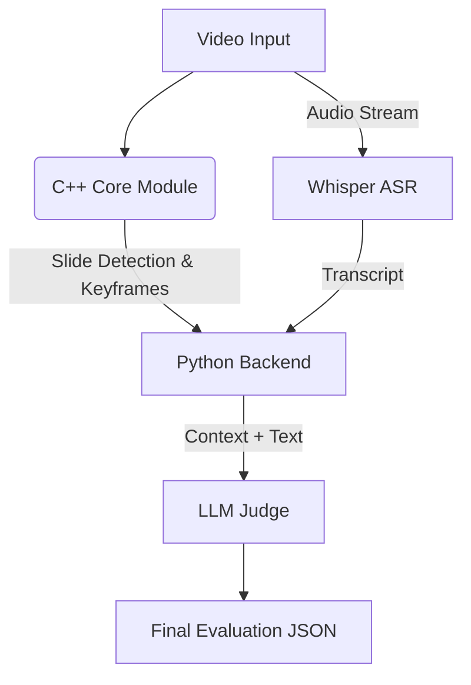

# AI-Powered Interview Judge 🧠⚖️

An end-to-end multimodal AI system designed to automatically evaluate technical interviews and presentations. The system analyzes video feeds to detect slide transitions, transcribes speech, synchronizes visual context with spoken audio, and uses LLMs to grade the candidate's performance.

## 🚀 Key Features

- **High-Performance Video Processing (C++):** A custom C++ engine using OpenCV and robust edge detection (Canny/Morphology) to identify slide transitions and keyframes, filtering out webcam noise
- **Multimodal Analysis:** Synchronizes visual data (slides) with audio transcripts (Whisper) to understand _what_ is shown vs. _what_ is said (coming soon)
- **AI Judging:** Uses Large Language Models (LLMs) to evaluate the relevance and accuracy of the speaker's answers based on the visual context (coming soon)
- **Hybrid Architecture:** Implements computationally heavy tasks in C++ bound to a Python backend via `pybind11`
- **RESTful API:** FastAPI-based backend for easy integration
- **Modular Design:** Clean separation of concerns with service layer architecture

## 🛠️ Tech Stack

- **Core Engine:** C++17, OpenCV 4.x
- **Bindings:** pybind11
- **Backend:** Python 3.10+, FastAPI
- **AI/ML:** OpenAI Whisper (ASR), PyTorch, LLMs (OpenAI/Local)
- **Build System:** CMake, uv, Docker

## 🏗️ Architecture

The project follows a **Hybrid Monorepo** structure:



## 📂 Project Structure

Plaintext

```
ai-interview-judge/
├── cpp_core/           # C++ Library for video processing
│   ├── include/        # Headers
│   └── src/            # Implementation & Bindings
├── backend/            # FastAPI service & Business Logic
├── tests/              # GTest (C++) and Pytest (Python)
└── docker/             # Containerization
```

## 📅 Roadmap

- [ ] **Sprint 1:** C++ Scene Detection Engine & Python Bindings.
- [ ] **Sprint 2:** Multimodal Extraction (OCR + ASR Integration).
- [ ] **Sprint 3:** Logic Core & LLM Evaluation Pipeline.
- [ ] **Sprint 4:** MLOps (Docker, CI/CD, API).

## 📦 Build & Run

### Prerequisites

- CMake >= 3.10
- C++ Compiler (GCC/Clang/MSVC)
- Python >= 3.10
- OpenCV 4.x

_(Detailed build instructions coming in Sprint 1)_

---

_Author: [bigalex95](https://www.google.com/search?q=https://github.com/bigalex95)_
